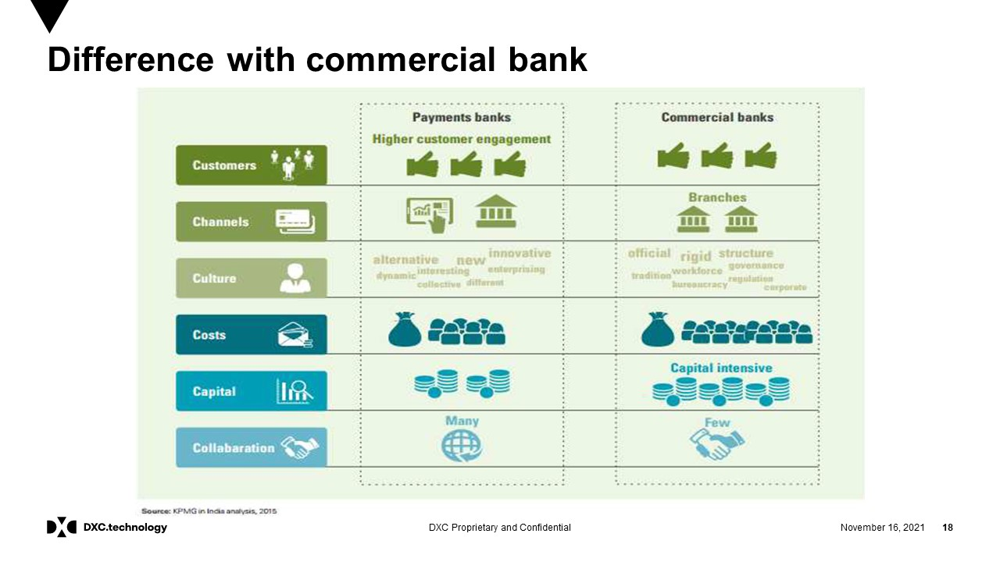
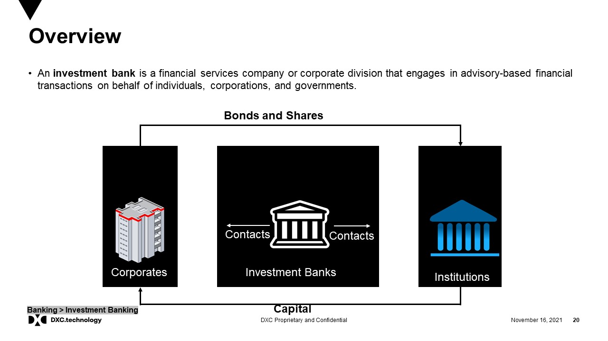
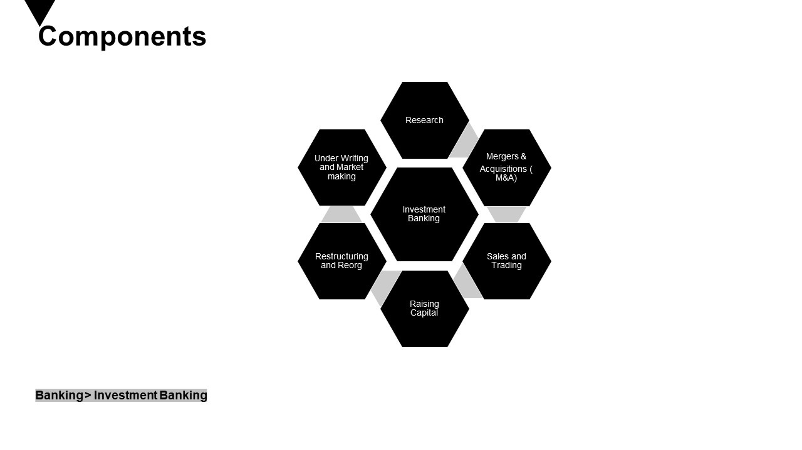

# Business / commercial / investment banking

🏦 Business (Commercial \& Investment) Banking Domain Model

1. Customer Segments

Commercial Banking: SMEs, large enterprises, government, and institutional clients.

Investment Banking: Corporates, investors, high-net-worth individuals, governments.

2. Core Services

🔹 Commercial Banking

Corporate Lending (working capital, term loans, syndicated loans)

Treasury \& Cash Management (liquidity, payments, receivables)

Trade Finance (letters of credit, guarantees, supply chain finance)

Merchant Services (POS, corporate cards, digital payments)

🔹 Investment Banking

Components of Investment Banking

Capital Raising (equity, debt, IPOs, private placements)

Advisory (M\&A, restructuring, valuations)

Sales \& Trading (equities, fixed income, derivatives, commodities, FX)

Asset Management \& Private Equity

Research \& Market Intelligence

3. Risk \& Compliance

Credit \& Market Risk Management

Liquidity \& Interest Rate Risk

Regulatory Compliance (Basel III, Dodd-Frank, MiFID II, SEBI, etc.)

AML \& KYC

4. Operations \& Infrastructure

Clearing, Settlement \& Custody

Collateral \& Margin Management

Data \& Reporting (regulatory, risk, client)

Treasury Systems \& Trade Platforms

5. Technology Enablement

Core Banking \& Treasury Systems

Electronic Trading Platforms

AI \& Analytics (fraud detection, trading insights)

Blockchain (trade finance, settlements, tokenization)

Cloud \& API ecosystems

📊 Simplified Layers (Domain Model):
Client Segments → Core Banking / Investment Services → Risk \& Compliance → Operations → Technology Infrastructure

✅ Summary:

Commercial banking serves business clients with lending, trade finance, and treasury services.

Investment banking focuses on capital markets, advisory, and trading to help organizations raise funds, manage risk, and grow.

Both are underpinned by strong risk management, compliance, and technology platforms.

[Business loan](https://en.wikipedia.org/wiki/Loan)

[Capital raising (equity / debt / hybrids)](https://en.wikipedia.org/wiki/Stock_exchange#Raising_capital_for_businesses)

[Revolving credit](https://en.wikipedia.org/wiki/Revolving_credit)

[Risk management (foreign exchange (FX)), interest rates, commodities, derivatives](https://en.wikipedia.org/wiki/Risk_management)

[Term loan](https://en.wikipedia.org/wiki/Term_loan)

[Credit services](https://en.wikipedia.org/wiki/Credit_(finance))

