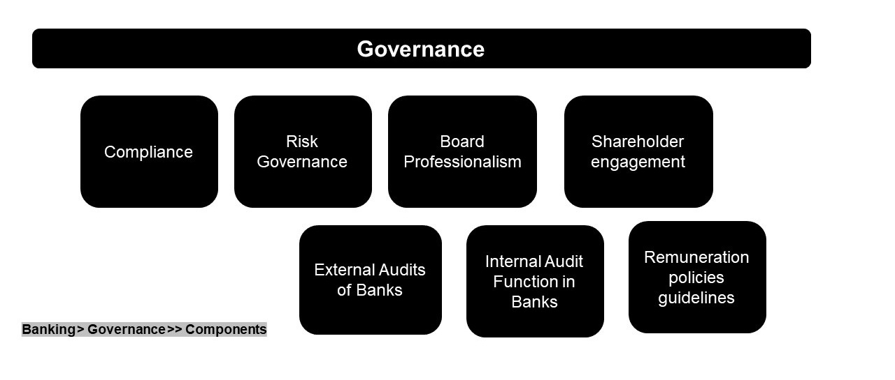

# Governance \& Control

Governance and control in banking refer to the framework of rules, processes, and policies that ensure a bank is managed in a responsible, transparent, and ethical manner. This framework is essential for protecting the interests of all stakeholders, including depositors, shareholders, regulators, and the public. Unlike other businesses, banks have a unique and critical role in the economy, so their governance systems are subject to strict and extensive regulation to ensure financial stability.

Key Principles of Governance and Control
The principles of effective banking governance are rooted in the need for a strong internal structure and external oversight.

Board Oversight: The board of directors is at the top of the governance structure. Their primary responsibility is to approve the bank’s strategic objectives, set its risk appetite, and ensure that a strong corporate culture is in place. They are also responsible for overseeing management's implementation of policies and controls.

Clear Lines of Authority: The banking system must have a well-defined structure with clear roles, responsibilities, and decision-making authority from the board to senior management and throughout all business units. This prevents confusion and holds individuals accountable.

Risk Management: This is a core component of banking control. Banks must have independent and robust risk management functions to identify, measure, monitor, and control all material risks, including credit, market, liquidity, and operational risks.

Internal Controls and Audit: These are the operational mechanisms that ensure a bank's policies and procedures are followed. Internal controls are designed to prevent errors and fraud, while an independent internal audit function periodically evaluates the effectiveness of these controls and ensures compliance.

Transparency and Disclosure: Banks are required to be transparent with their stakeholders. This includes providing accurate and timely financial reporting and disclosing information about their governance structure, risk exposures, and compensation practices.

The Role of Regulators
Regulatory bodies (like the Federal Reserve in the U.S. or the Reserve Bank of India) play a crucial role in enforcing banking governance and control. Their oversight is what distinguishes banking from other industries.

Setting the Rules: Regulators establish legal requirements and guidelines that dictate how banks must operate, from capital adequacy ratios and liquidity requirements to standards for risk management and corporate governance.

Supervision: Regulators conduct regular on-site and off-site inspections to monitor banks' compliance with the rules. They evaluate a bank’s financial health, internal controls, and risk management systems.

Enforcement: When a bank fails to comply, regulators have the authority to impose penalties, issue directives, or, in severe cases, revoke the bank's license.

Ultimately, governance and control in banking are about building a system of checks and balances to ensure the safety and soundness of individual institutions, which, in turn, protects the stability of the entire financial system.

🏦 Governance \& Control in Banking System

1. Corporate Governance Framework

Board of Directors \& Committees

Audit Committee, Risk Committee, Remuneration Committee

Independent directors ensuring transparency \& accountability

Executive Management

CEO, CIO, CRO, CFO driving strategic and operational execution

2. Regulatory Oversight

Central Banks \& Regulators

RBI, Federal Reserve, ECB, FCA, SEC etc.

Compliance Standards

Basel III/IV (capital adequacy, liquidity)

IFRS/GAAP (financial reporting)

AML/KYC regulations

GDPR/DPDP (data protection \& privacy)

3. Risk Governance

Enterprise Risk Management (ERM) framework

Three Lines of Defense Model

Business Units – own \& manage risks

Risk \& Compliance Functions – oversight \& monitoring

Internal Audit – independent assurance

Types of Risks Controlled:

Credit Risk

Market Risk

Operational Risk

Liquidity Risk

Cybersecurity Risk

4. Internal Controls

Policies \& Procedures – standardized workflows \& approvals

Segregation of Duties – avoiding conflict of interest

Access Controls \& Cybersecurity – IAM, encryption, fraud detection

Audit \& Monitoring – internal audits, stress testing, compliance reviews

5. Reporting \& Transparency

Periodic financial disclosures

Stress test results (regulatory requirement)

Sustainability \& ESG disclosures (increasingly mandatory)

✅ In summary:
Governance and control in banking ensures accountability, compliance, risk mitigation, and transparency, through regulatory frameworks, board oversight, risk governance, and internal control mechanisms—all aimed at maintaining financial stability and trust.

