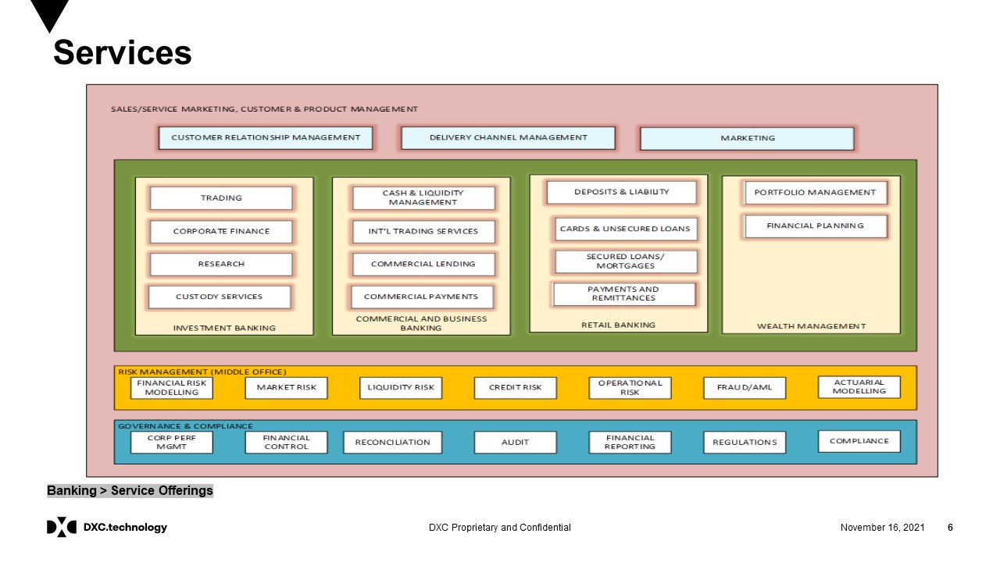
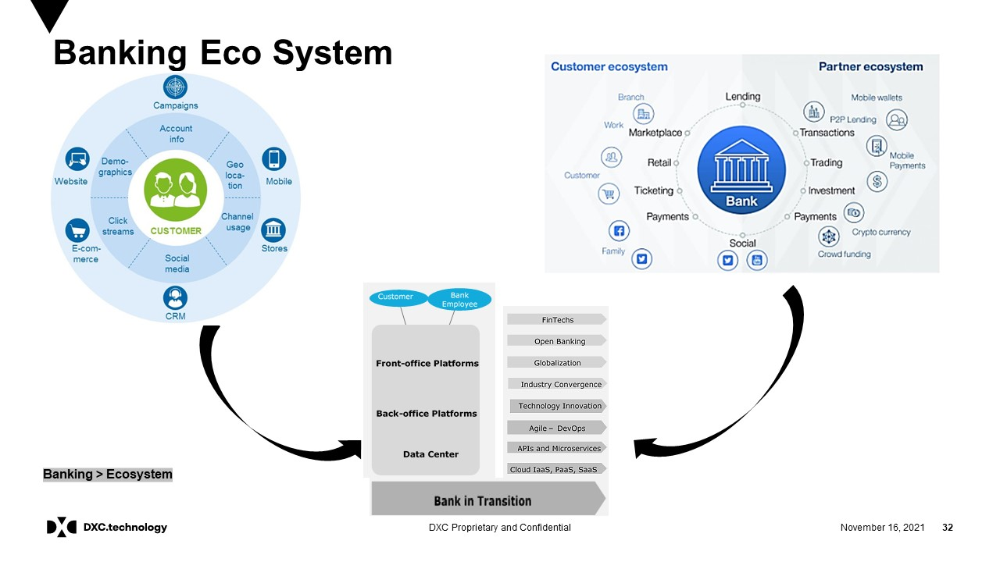
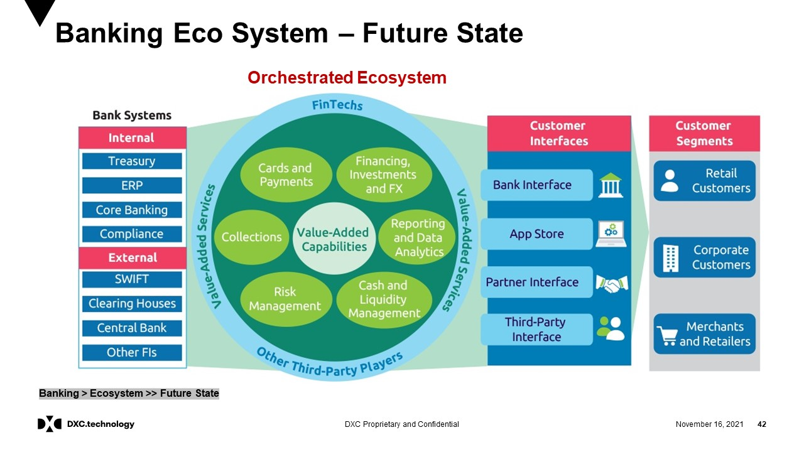
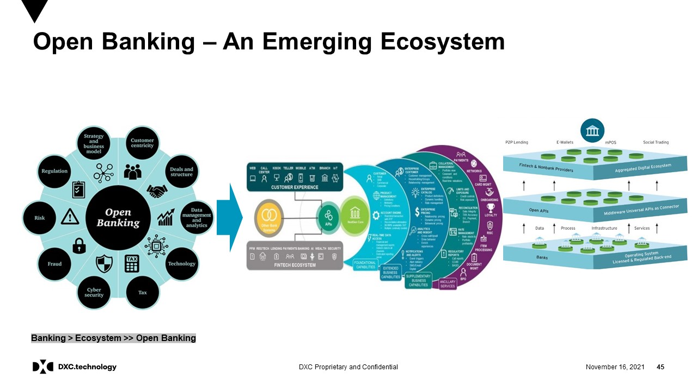
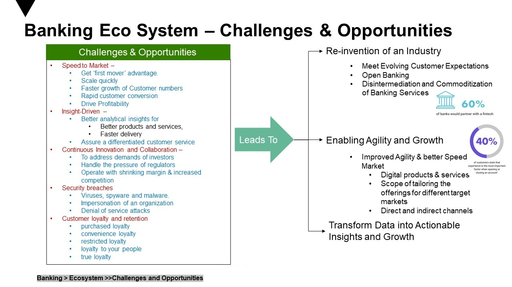
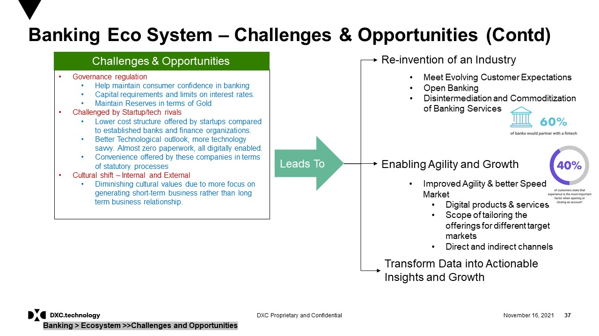

# Overview of Banking Industry

Banks as financial intermediaries are party to a transfer of funds from the ultimate saver to the ultimate user of funds. Often, banks usefully alter the terms of the contractual arrangement as the funds move through the transfer process in a manner that supports and promotes economic activity. By issuing tradable claims (bank deposits) against itself, the bank can add a flexibility to the circulating media of exchange in a manner that enhances the performance of the payments system. These deposits may support the extension of personal credit to consumers (retail banking) or short-term credit to nonfinancial businesses (commercial banking). If so, the bank aids the management of liquidity, thus promoting household consumption and commerce. By facilitating the collection of funds from a large number of small savers, each for a short period, the bank promotes the pooling of funds to lend out in larger denominations for longer periods to those seeking to finance investment in larger capital projects. Financing investment may take the form of underwriting issues of securities (investment banking) or lending against real estate (mortgage banking). By specializing in the assessment of risk, the bank can monitor borrower performance; by diversifying across investment projects, the bank minimizes some types of risk and promotes the allocation of funds to those endeavours with the greatest economic potential. By extending trade credit internationally (merchant banking), the bank can facilitate international trade and commerce. As one last example, by lending to other banks in times of external pressures on liquidity, the bank can manage core liquidity in the financial system, thus potentially stabilizing prices and output (central banking).

To discharge its various functions, banks of all types manage highly leveraged portfolios of financial assets and liabilities. Some of the most crucial questions for the banking industry and state regulators center on questions of how best to manage the portfolio of deposit banks, given the vital role of these banks in extending commercial credit and enabling payments. With bank capital (roughly equal to the net value of its assets after deduction of its liabilities) but a small fraction of total assets, bank solvency is particularly vulnerable to credit risk, market risk, and liquidity risk. An increase in non-performing loans, a drop in the market price of assets, or a shortage of cash reserves that forces a distress sale of assets to meet depositors’ demand can each, if transpiring over a period of time too short for the bank to manage the losses, threaten bank solvency.

Here’s a crisp overview of the Banking Industry:

🏦 Industry Landscape

The banking industry is a cornerstone of the global economy, enabling financial intermediation, capital flow, and risk management.

It is broadly divided into retail banking, corporate banking, investment banking, private banking, and central banking.

## Banking Eco System

A banking ecosystem is a collaborative network of participants—including traditional banks, FinTechs, technology providers, and regulators—that work together to provide a seamless and comprehensive suite of financial and non-financial services to customers. This model moves beyond the traditional, bank-centric approach to one where a bank acts as a platform, integrating third-party services via APIs to create a holistic customer experience.

Key Components
Traditional Banks: These are the established financial institutions with a core infrastructure for deposits, lending, and payments. In an ecosystem model, they can act as a central hub, a service provider to other players, or a combination of both.
FinTechs: These are agile technology-driven companies that specialize in specific financial services, such as digital payments, peer-to-peer lending, or robo-advisory. They often partner with banks to offer innovative products and services without the overhead of building a full-scale bank.
Technology Providers: This group includes companies that offer essential infrastructure and tools, such as cloud computing platforms (e.g., AWS, Azure), AI and data analytics solutions, and API developers. They are the technological backbone that makes the ecosystem work.
Regulators: Regulatory bodies (like the Reserve Bank of India or the European Central Bank) set the rules and frameworks that govern the ecosystem, ensuring consumer protection, data security, and fair competition.
Customers: Customers are at the center of the ecosystem. Their changing preferences for digital, personalized, and convenient services are the driving force behind the shift to this model.
How It Works
The modern banking ecosystem is primarily enabled by open banking and APIs (Application Programming Interfaces). Open banking regulations compel banks to securely share customer data (with consent) with third-party providers. APIs are the technical bridges that allow different systems to communicate, enabling FinTechs to access banking services and data to build new applications.
For example, a bank might partner with a FinTech that provides a personal finance management app. The FinTech uses the bank's API to access a customer's transaction data, and then uses that data to provide the customer with personalized budget tracking and financial insights, all from within the FinTech's app. This creates a more valuable service for the customer and allows the bank to expand its reach without building the service in-house.
Advantages of an Ecosystem
Enhanced Customer Experience: Customers get access to a wider range of services—both financial and non-financial—from a single point of interaction. This creates a "one-stop-shop" for their financial lives.
Faster Innovation: Banks can leverage the agility of FinTechs to bring new products to market quickly without the time and cost of internal development.
Increased Revenue Streams: Banks can monetize their data and infrastructure by providing "Banking as a Service" (BaaS) to other businesses, creating new revenue channels.
Improved Efficiency: By outsourcing non-core functions to specialized partners, banks can focus on their core competencies, leading to greater operational efficiency.
🏦 Banking Ecosystem
1.	Core Participants
Banks & Financial Institutions
Retail Banks
Commercial & Corporate Banks
Investment Banks
Cooperative & Regional Banks
Central Banks & Regulators
RBI, ECB, Federal Reserve, etc.
Compliance authorities (SEBI, SEC, FCA, etc.)
2.	Customers & Segments
Individuals (savings, loans, investments)
SMEs & Corporates (treasury, trade finance, credit)
Governments & Institutions (bonds, fiscal transactions)
3.	Enablers & Partners
FinTechs & Neobanks – digital-first innovators (payments, lending, robo-advisors).
Payment Networks – Visa, Mastercard, SWIFT, UPI, RuPay.
Technology Providers – Cloud, AI, Blockchain, Cybersecurity, Core Banking systems.
Consulting & Outsourcing Firms – System integrators, IT service providers, BPO/KPO.
4.	Products & Services
Deposits, Loans, Mortgages, Credit Cards
Payments & Remittances
Wealth & Asset Management
Insurance & Pension Solutions
Trade Finance & Treasury Services
Investment Advisory & Capital Markets
5.	Technology & Infrastructure
Core Banking Systems (CBS)
Digital Platforms (mobile, internet, APIs)
Open Banking & API Ecosystems (collaboration with FinTechs)
Cybersecurity & Identity Management
Blockchain & Distributed Ledgers (payments, trade, smart contracts)
6.	Regulatory & Risk Management
Anti-Money Laundering (AML)
Know Your Customer (KYC)
Basel III, IFRS, MiFID II, GDPR
Cyber & Operational Risk Controls
📊 Ecosystem Flow (Simplified):
Customers ⇆ Banks ⇆ FinTechs/Payment Systems ⇆ Regulators ⇆ Technology Providers

Banking Eco System Future State

✅ Future State Vision

Banking becomes ecosystem-centric, offering end-to-end financial and lifestyle services.

Driven by open banking, API economy, FinTech collaboration, and data analytics.

Focus on customer experience, risk management, and liquidity optimization.

Banks will evolve from siloed systems to a collaborative ecosystem integrating internal systems, FinTechs, third-party players, and customer interfaces to deliver value-added services.

1\. Bank Systems (Left Column)

Internal Systems: Treasury, ERP, Core Banking, Compliance.

External Systems: SWIFT, Clearing Houses, Central Bank, Other Financial Institutions.

Role: These systems form the backbone for transactions, compliance, and operations.

2\. Value-Added Capabilities (Center Circle)

Core Services: Cards \& Payments, Financing \& Investments, FX (Foreign Exchange).

Advanced Services: Reporting \& Data Analytics, Collections, Risk Management, Cash \& Liquidity Management.

Purpose: Move beyond basic banking to offer analytics-driven, risk-aware, and liquidity-focused solutions.

3\. Integration with FinTechs \& Third-Party Players

Banks collaborate with FinTechs and other partners to deliver innovative services like:

Digital payments

Investment platforms

Data-driven insights

Goal: Expand offerings and improve customer experience through partnerships.

4\. Customer Interfaces (Right Column)

Bank Interface: Traditional and digital banking portals.

App Store: Access to banking and partner apps.

Partner Interface: Integration with external service providers.

Third-Party Interface: Open banking APIs for external developers.

5\. Customer Segments

Retail Customers

Corporate Customers

Merchants \& Retailers

Goal: Serve diverse customer needs through personalized and integrated services.

Open Banking and Emerging Eco System

🔑 Key Functions

Deposits \& Lending: Safekeeping of money, providing loans, mortgages, and credit.

Payments \& Settlements: Facilitating secure and fast domestic/international transactions.

Wealth Management: Investment, asset management, and financial advisory.

Risk Management \& Compliance: Ensuring financial stability under regulatory frameworks.

📈 Industry Trends

Digital Transformation: Rise of mobile \& online banking, digital wallets, and contactless payments.

FinTech Disruption: Collaboration/competition with startups offering innovative solutions (BNPL, neobanks, robo-advisors).

AI \& Data: Personalized financial services, fraud detection, and predictive risk analytics.

Blockchain \& CBDCs: Driving secure, transparent, and faster transactions.

Sustainability (Green Banking): Financing ESG projects and responsible lending.

⚖️ Challenges

Cybersecurity threats and data privacy risks.

Stringent regulatory compliance and capital adequacy requirements.

Low interest rate pressures impacting margins in some regions.

Competition from Big Tech and FinTechs changing customer expectations.

✅ In summary: The banking industry is evolving from traditional branch-led models to digital-first, customer-centric ecosystems, leveraging AI, FinTech collaboration, and sustainable finance to remain resilient and competitive.

